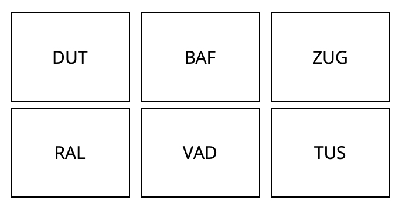

# Serial reaction time to audio stimuli: A plugin for jsPsych 7


## The Serial Reaction Time (SRT) task

Proposed in [Misyak et al. (2010)](https://onlinelibrary.wiley.com/doi/10.1111/j.1756-8765.2009.01072.x) as a way to study online learning of probabilistic sequences, the SRT paradigm tracks participants' reaction time to sequential audio stimuli.

Audio recordings of target words are played (e.g., the nonwords *ral*, *baf*, *tus*), and participants must click on each of them in the grid while avoiding the foil words (e.g., *dut*, *vad*, and *zug*).




## How to use

See this plugin, `audio-button-response-grid`, in action by opening [`index.html`](index.html) in a browser.
The experiment code can be found in [`exp.js`](exp.js).

This code illustrates a 2x3 grid (as in the original study of three-word non-adjacent dependencies) as well as a 2x2 grid.


## Parameters

 `audio-button-response-grid` has the usual parameters of jsPsych's existing `audio-button-response` plugin (see its documentation [here](https://www.jspsych.org/7.0/plugins/audio-button-response/)), with the addition of:

- `rows`: Integer, the number of rows the grid should have.
- `columns`: Integer, the number of columns the grid should have.


## Citation

If you use this plugin, please cite this repository:

```
@misc{Pankratz_Serial_reaction_time_2023,
  author = {Pankratz, Elizabeth},
  month = jul,
  title = {{Serial reaction time to audio stimuli: A plugin for jsPsych 7}},
  url = {https://github.com/elizabethpankratz/srt-audio-jspsych},
  year = {2023}
}
```


## References

Misyak, J. B., Christiansen, M. H., & Bruce Tomblin, J. (2010). *Sequential Expectations: The Role of Prediction-Based Learning in Language.* Topics in Cognitive Science, 2(1), 138–153. <https://doi.org/10.1111/j.1756-8765.2009.01072.x>

